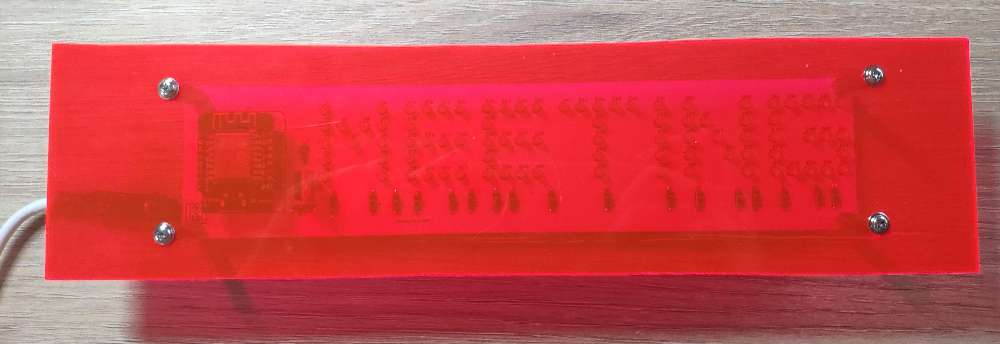

<!-- PROJECT LOGO -->
<br />
<p align="center">
  
  <h3 align="center">Availability Checker</h3>

  <p align="center">
    Grab the usage of the microphone and trigger an availability lamp accordingly
  </p>
</p>
<br/><br/>

<!-- ABOUT THE PROJECT -->
## About The Project

After being "forced" to work from the home office by corona , I was increasingly confronted with the situation of family or roommates unintentionally bursting into the room during meetings. A friend then gave me an LED sign that could visually reflect my availability status.
<br/>
Since the Microsoft Teams API for the presents is extremely cumbersome for privacy reasons, I coded a small workaround that also works for other programs.

### Built With

* [WMOS D1 Mini](https://www.makershop.de/plattformen/d1-mini/wemos-d1-mini/)
* [PlatformIO](https://platformio.org/)
* [Mosquitto](https://mosquitto.org/)

<!-- GETTING STARTED -->
## Getting Started

To get a local copy up and running follow these simple steps.

### Prerequisites
```sh
git clone https://github.com/bremade/AvailabilityChecker.git
```
This is an example of how to list things you need to use the software and how to install them.
#### Windows Application
1. Import Project to Visual Studio 2019
2. Install needed packages
3. Build the project using the release/debug config
   ```sh
   press Ctrl + Shift + b
   ```
4. Adapt marked configurations for MQTT-BROKER
    * host
    * topic
    * user
    * password
#### ESP Application
1. Install PlatformIO plugin for Visual Studio Code
2. Adapt platformio.ini for your corresponding micro controller
3. Adapt marked configurations for MQTT-Broker and WIFI access
    * ssid
    * password
    * mqtt host
    * mqtt topic
    * mqtt user
    * mqtt password
#### MQTT Broker
For the async communication a mqtt broker is required. I used mosquitto on my raspberry pi. See in the Acknowledgements for a tutorial.

<!-- USAGE EXAMPLES -->
## Usage
After installing and openening the programm the microphone status will be retrieved every 5 minutes. The interval can be adapted by changing the value `INTERVAL_MINUTES`. The the task will stop automaticly after the enddate (8 hours aka one workday) is reached.
<br/>
By using the controlls in the tray the status can be toggled manually.
<br/>


<mark style="background-color: red">Make sure that the mic in use icon is pinned in the taskbar</mark>
<br/>


<!-- LICENSE -->
## License

Distributed under the MIT License. See `LICENSE` for more information.


<!-- CONTACT -->
## Contact

Jan Bremauer - [@BremauerJan](https://twitter.com/BremauerJan) - mail@bremauer.cc

Project Link: [https://github.com/bremade/AvailabilityChecker](https://github.com/bremade/AvailabilityChecker)


<!-- ACKNOWLEDGEMENTS -->
## Acknowledgements
* [List tray information - Windows 10](https://windows-hexerror.linestarve.com/q/so33652756-how-to-get-the-processes-that-have-systray-icon)
* [Set up MQTT Broker on Raspberry PI](https://plantprogrammer.de/mqtt-auf-dem-raspberry-pi-mosquitto/)
